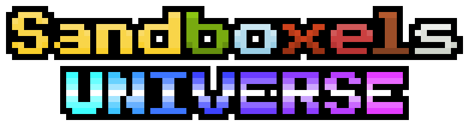

# Sandboxels Universe

**Sandboxels Universe** is a customized version of the Sandboxels falling-sand simulation, built around a new visual identity and a growing collection of Universe-specific content and features.

Sandboxels Universe keeps the core sandbox simulation while providing a dedicated home for custom elements, reactions, assets, tools, and other additions.

## Play

The project is designed to run directly in a web browser.

Once deployed through GitHub Pages, the game can be played from the project's published website.

## Modding & Development

Sandboxels Universe is based on the Sandboxels project and retains its modding capabilities.

For general Sandboxels modding information, see the [Sandboxels Wiki](https://sandboxels.wiki.gg/wiki/Modding/Getting_started).

Universe-specific content and changes will be maintained in this repository.

## Controls

* Left Click = Draw pixels
* Right Click = Erase pixels
* Middle Click = Pick element
* Space or P = Pause simulation
* Shift + Heat/Cool/Shock = Intensify effect
* Shift + Click = Draw line
* Scroll or +- or [] = Change cursor size
* ←→ = Change category
* E = Select by name
* I or / = Element info
* \ = Open settings
* > = Single step
* F or F11 = Fullscreen
* 1234 = Change view
* F1 = Toggle GUI
* C or F2 = Capture screenshot

(Alt/Option can be used in place of Shift.)

## Button Info

* **Pause** = Pause/play the simulation
* **Step (>)** = Run a single frame
* **Minus (-)** = Decrease the cursor size
* **Plus (+)** = Increase the cursor size
* **Reset** = Clears the entire simulation
* **Replace** = Overrides pixels when placing
* **E** = Select any element by name
* **TPS** = Change how fast the simulation runs
* **Info** = Open the element info screen
* **Saves** = Open the Save & Load menu
* **Mods** = Open the Mod Manager
* **Settings** = Open the settings menu

## About Sandboxels

Sandboxels Universe is based on [Sandboxels](https://github.com/R74nCom/sandboxels), an open-ended falling-sand simulation with elements, heat simulation, chemical reactions, fire, density, electricity, and more.

Sandboxels Universe is maintained separately as a customized project, with its own branding, assets, and future additions.

Please retain and review the original Sandboxels license and attribution files included in this repository.

## Repository

[Sandboxels Universe on GitHub](https://github.com/EnterTheRetroverse/sandboxelsUniverse)
